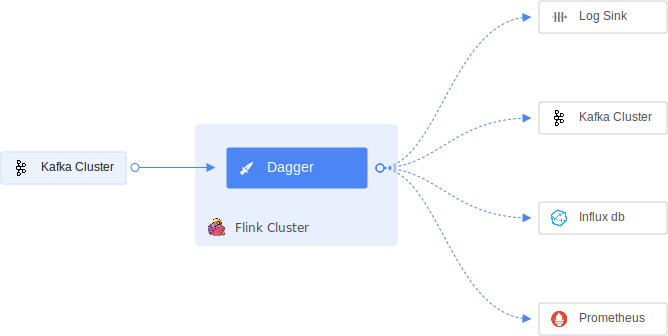

# Introduction
Dagger or Data Aggregator is an easy-to-use, configuration over code, cloud-native framework built on top of Apache Flink for stateful processing of real-time streaming data. With Dagger, you don't need to write custom applications or manage resources to process data in real-time.
Instead, you can write SQLs to do the processing and analysis on streaming data.

## Key Features
Discover why to use Dagger

* **Processing:** Dagger can transform, aggregate, join and enrich Protobuf data in real-time.
* **Scale:** Dagger scales in an instant, both vertically and horizontally for high performance streaming sink and zero data drops.
* **Extensibility:** Add your own sink to dagger with a clearly defined interface or choose from already provided ones.
* **Pluggability:** Add custom business logic in form of plugins \(UDFs, Transformers, Preprocessors and Post Processors\) independent of the core logic. 
* **Metrics:** Always know what’s going on with your deployment with built-in [monitoring](docs/../reference/metrics.md) of throughput, response times, errors and more.

## What problems Dagger solves?
* Map reduce -> [SQL](https://ci.apache.org/projects/flink/flink-docs-release-1.9/dev/table/sql.html)
* Enrichment -> [Post Processors](docs/../advance/post_processor.md)
* Aggregation -> [SQL](https://ci.apache.org/projects/flink/flink-docs-release-1.9/dev/table/sql.html), [UDFs](docs/../guides/use_udf.md)
* Masking -> [Hash Transformer](docs/../reference/transformers.md#HashTransformer)
* Deduplication -> [Deduplication Transformer](docs/../reference/transformers.md#DeDuplicationTransformer)
* Realtime long window processing -> [Longbow](docs/../advance/longbow.md)

To know more, follow the detailed [documentation](https://odpf.gitbook.io/dagger).

## Usage

Explore the following resources to get started with Dagger:

* [Guides](docs/../guides/overview.md) provides guidance on [creating Dagger](docs/../guides/overview.md) with different sinks.
* [Concepts](docs/../concepts/overview.md) describes all important Dagger concepts.
* [Advance](docs/../advance/overview.md) contains details regarding advance features of Dagger.
* [Reference](docs/../reference/overview.md) contains details about configurations, metrics and other aspects of Dagger.
* [Contribute](docs/../contribute/contribution.md) contains resources for anyone who wants to contribute to Dagger.
* [Usecase](docs/../usecase/overview.md) describes examples use cases which can be solved via Dagger.
