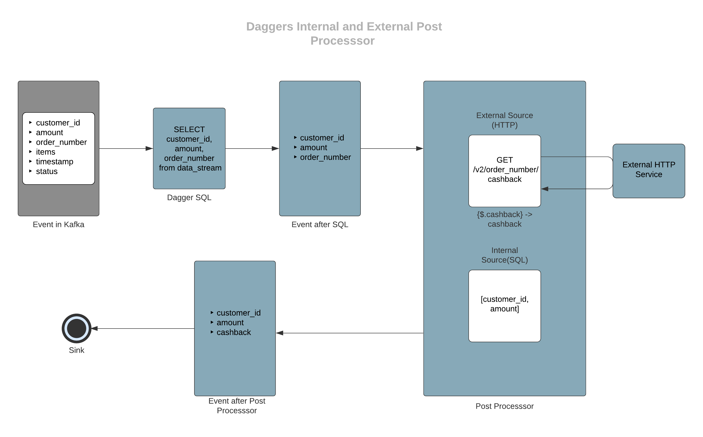
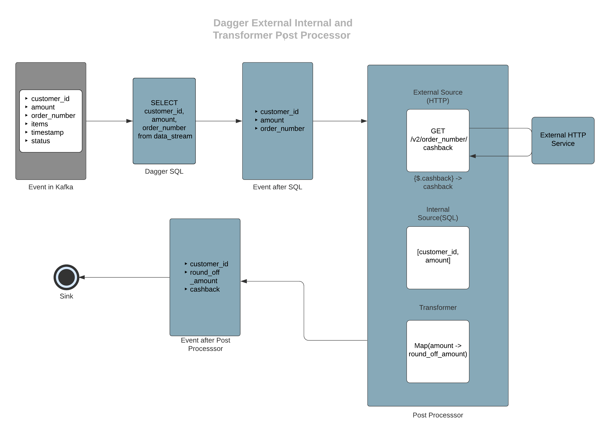

# Introduction
Post Processors give the capability to do custom stream processing after the SQL processing is performed. Complex transformation, enrichment & aggregation use cases are difficult to execute & maintain using SQL. Post Processors solve this problem through code and/or configuration. This can be used to enrich the stream from external sources (HTTP, ElasticSearch, PostgresDB, GRPC), enhance data points using function or query and transform through user-defined code.

## Flow of Execution
In the flow of Post Processors, External Post Processors, Internal Post Processors and Transformers can be applied sequentially via config. The output of one Post Processor will be the input of the next one. The input SQL is executed first before any of the Post Processors and the Post Processors run only on the output of the SQL. Here is an example of a simple use case that can be solved using Post Processor and sample Data flow Diagrams for that.

* Let's assume that you want to find cashback given for a particular order number from an external API endpoint. You can use an HTTP external post-processor for this. Here is a basic Data flow diagram.

<p align="center">
  
</p>

* In the above example, assume you also want to output the information of customer_id and amount which are fields from input proto. Internal SQL Post Processor can be used for selecting these fields from the input stream.

<p align="center">
  
</p>

* After getting customer_id, amount, and cashback amount, you may want to round off the cashback amount. For this, you can write a custom transformer which is a simple Java Flink Map function to calculate the round-off amount.

  **Note:** All the above processors are chained sequentially on the output of previous processor. The order of execution is determined via the order provided in json config.

<p align="center">
  
</p>

## Types of Post Processors
There are three types of Post Processors :
* [External Post Processor](post_processor.md#external-post-processor)
* [Internal Post Processor](post_processor.md#internal-post-processor)
* [Transformers](docs/../../guides/use_transformer.md)

(Post Processors are entirely configuration driven. All the Post Processor related configs should be configured as part of [PRE_PROCESSOR_CONFIG](update link) json under Settings in Dagger creation flow. Multiple Post Processors can be combined in the same configuration and applied to a single Dagger. )

### External Post Processor
External Post Processor is the one that connects to an external data source to fetch data in an async manner and perform enrichment of the stream message. These kinds of Post Processors use Flink’s API for asynchronous I/O with external data stores. For more details on Flink’s Async I/O find the doc [here](https://ci.apache.org/projects/flink/flink-docs-release-1.9/dev/stream/operators/asyncio.html).
Currently, we are supporting four external sources as part of this.

#### Elasticsearch 
This enables you to enrich the input streams with any information present in any remote [Elasticsearch](https://www.elastic.co/). For example let's say you have payment transaction logs in input stream but user profile information in Elasticsearch, then you can use this post processor to get the profile information in each record.

##### Configuration

Following variables need to be configured as part of [POST_PROCESSOR_CONFIG](update link) json

###### `host`

IP(s) of the nodes/haproxy.

* Example value: `localhost`
* Type: `required`

###### `port`

Port exposed for the same.

* Example value: `9200`
* Type: `required`

###### `user`

Username for Elasticsearch.

* Example value: `testuser`
* Type: `optional`

###### `password`

Password for Elasticsearch.

* Example value: `test`
* Type: `optional`

###### `endpoint_pattern`

String template for the endpoint. This will be appended to the host to create the final URL.

* Example value: `/customers/customer/%s`
* Type: `required`

###### `endpoint_variables`

Comma-separated list of variables used for populating identifiers in endpoint_pattern.

* Example value: `customer_id`
* Type: `optional`

###### `retain_response_type`

If true it will not cast the response from ES to output proto schema. The default behaviour is to cast the response to the output proto schema.

* Example value: `false`
* Type: `optional`
* Default value: `false`

###### `retry_timeout`

Timeout between request retries in ms.

* Example value: `5000`
* Type: `required`

###### `socket_timeout`

The time waiting for data after establishing the connection in ms; maximum time of inactivity between two data packets.

* Example value: `6000`
* Type: `required`

###### `connect_timeout`

Timeout value for ES client in ms.

* Example value: `5000`
* Type: `required`

###### `capacity`

This parameter(Async I/O capacity) defines how many asynchronous requests may be in progress at the same time.

* Example value: `30`
* Type: `required`

###### `output_mapping`

Mapping of fields in output Protos goes here. Based on which part of the response data to use, you can configure the path, and output message fields will be populated accordingly.

* Example value: `{"customer_profile":{ "path":"$._source"}}`
* Type: `required`

###### `fail_on_errors`

A flag for deciding whether the job should fail on encountering errors or not. If set false the job won’t fail and enrich with empty fields otherwise the job will fail.

* Example value: `false`
* Type: `optional`
* Default value: `false`

###### `metric_id`

Identifier tag for metrics for every post processor applied. If not given it will use indexes of post processors in the json config.

* Example value: `test_id`
* Type: `optional`

##### Sample Query
You can select the fields that you want to get from input stream or you want to use for making the request.
  ```SQL
  SELECT customer_id from `booking`
  ```

##### Sample Configuration
  ```properties
  POST_PROCESSOR_ENABLED = true
  POST_PROCESSOR_CONFIG = {
    "external_source": {
      "es": [
        {
          "host": "127.0.0.1",
          "port": "9200",
          "endpoint_pattern": "/customers/customer/%s",
          "endpoint_variables": "customer_id",
          "retry_timeout": "5000",
          "socket_timeout": "6000",
          "stream_timeout": "5000",
          "connect_timeout": "5000",
          "capacity": "30",
          "output_mapping": {
            "customer_profile": {
              "path": "$._source"
            }
          }
        }
      ]
    }
  }
  ```

#### HTTP 
HTTP Post Processor connects to an external REST endpoint and does enrichment based on data from the response of the API call. Currently, we support POST and GET verbs for the API call.

##### Configuration

Following variables need to be configured as part of [POST_PROCESSOR_CONFIG](update link) json

###### `endpoint`

IP(s) of the nodes/haproxy.

* Example value: `http://127.0.0.1/api/customer`
* Type: `required`

###### `verb`

HTTP verb (currently support POST and GET).

* Example value: `GET`
* Type: `required`

###### `request_pattern`

Template for the body in case of POST and endpoint path in case of GET.

* Example value: `/customers/customer/%s`
* Type: `required`

###### `request_variables`

List of comma separated parameters to be replaced in request_pattern, these variables must be present in the input proto.

* Example value: `customer_id`
* Type: `optional`

###### `stream_timeout`

Timeout value for the stream in ms.

* Example value: `5000`
* Type: `required`

###### `connect_timeout`

Timeout value for HTTP client in ms.

* Example value: `5000`
* Type: `required`

###### `fail_on_errors`

A flag for deciding whether the job should fail on encountering errors(timeout and status codes apart from 2XX) or not. If set false the job won’t fail and enrich with empty fields otherwise the job will fail.

* Example value: `false`
* Type: `optional`
* Default value: `false`

###### `capacity`

This parameter(Async I/O capacity) defines how many asynchronous requests may be in progress at the same time.

* Example value: `30`
* Type: `required`

###### `headers`

Key-value pairs for adding headers to the request.

* Example value: `{"content-type": "application/json"}`
* Type: `optional`

###### `retain_response_type`

If true it will not cast the response from HTTP to output proto schema. The default behaviour is to cast the response to output proto schema.

* Example value: `false`
* Type: `optional`
* Default value: `false`

###### `output_mapping`

A mapping for all the fields we need to populate from the API response providing a path to fetch the required field from the response body.

* Example value: `{"customer_profile":{ "path":"$._source"}}`
* Type: `required`

###### `metric_id`

Identifier tag for metrics for every post processor applied. If not given it will use indexes of post processors in the json config.

* Example value: `test_id`
* Type: `optional`

##### Sample Query
You can select the fields that you want to get from input stream or you want to use for making the request.
  ```SQL
  SELECT customer_id from `booking`
  ```

##### Sample Configuration for GET
  ```properties
  POST_PROCESSOR_ENABLED = true
  POST_PROCESSOR_CONFIG = {
    "external_source": {
      "http": [
        {
          "endpoint": "http://127.0.0.1",
          "verb": "get",
          "request_pattern": "/customers/customer/%s",
          "request_variables": "customer_id",
          "stream_timeout": "5000",
          "connect_timeout": "5000",
          "fail_on_errors": "false",
          "capacity": "30",
          "headers": {
            "content-type": "application/json"
          },
          "output_mapping": {
            "customer_profile": {
              "path": "$._source"
            }
          }
        }
      ]
    }
  }
  ```

**Note:** In case you want to use all the fields along with a modification/nested field you can use “select *, modifield_field as custom_column_name from data_stream”.

##### Sample Configuration for POST
  ```properties
  POST_PROCESSOR_ENABLED = true
  POST_PROCESSOR_CONFIG = {
    "external_source": {
      "http": [
        {
          "endpoint": "http://127.0.0.1/customer",
          "verb": "post",
          "request_pattern": "{'key': \"%s\"}",
          "request_variables": "customer_id",
          "stream_timeout": "5000",
          "connect_timeout": "5000",
          "fail_on_errors": "false",
          "capacity": "30",
          "headers": {
            "content-type": "application/json"
          },
          "output_mapping": {
            "test_field": {
              "path": "$._source"
            }
          }
        }
      ]
    }
  }
  ```

**Note:** Post request patterns support both primitive and complex data types. But for complex objects you need to remove the quotes from the selector ( `%s`). So in case of a primitive datapoint of string the selector will be (`”%s”`) whereas for complex fields it will be (`%s`).

#### Postgres 
This enables you to enrich the input streams with any information present in any remote [Postgres](https://www.postgresql.org). For example let's say you have payment transaction logs in input stream but user profile information in Postgres, then you can use this post processor to get the profile information in each record. Currently, we support enrichment from PostgresDB queries that result in a single row from DB.

##### Configuration

Following variables need to be configured as part of [POST_PROCESSOR_CONFIG](update link) json

###### `host`

IP(s) of the nodes/haproxy.

* Example value: `http://127.0.0.1`
* Type: `required`

###### `port`

Port exposed for the same.

* Example value: `5432`
* Type: `required`

###### `user`

Username for Postgres.

* Example value: `testuser`
* Type: `required`

###### `password`

Password for particular user.

* Example value: `test`
* Type: `required`

###### `database`

Postgres database name.

* Example value: `testdb`
* Type: `required`

###### `query_pattern`

SQL query pattern to populate the data from PostgresDB.

* Example value: `select email, phone from public.customers where customer_id = '%s'`
* Type: `required`

###### `query_variables`

This is a comma-separated list (without any whitespaces in between) of parameters to be replaced in the query_pattern, and these variables must be present in the input proto.

* Example value: `customer_id`
* Type: `optional`

###### `stream_timeout`

Timeout value for the stream in ms.

* Example value: `25000`
* Type: `required`

###### `idle_timeout`

Timeout value for Postgres connection in ms.

* Example value: `25000`
* Type: `required`

###### `connect_timeout`

Timeout value for client in ms.

* Example value: `25000`
* Type: `required`

###### `fail_on_errors`

A flag for deciding whether the job should fail on encountering errors or not. If set false the job won’t fail and enrich with empty fields otherwise the job will fail.

* Example value: `false`
* Type: `optional`
* Default value: `false`

###### `capacity`

This parameter(Async I/O capacity) defines how many asynchronous requests may be in progress at the same time.

* Example value: `30`
* Type: `required`

###### `retain_response_type`

If true it will not cast the response from Postgres Query to output proto schema. The default behaviour is to cast the response to output proto schema.

* Example value: `false`
* Type: `optional`
* Default value: `false`

###### `output_mapping`

Mapping of fields in output Protos goes here. Based on which part of the response data to use, you can configure the path, and output message fields will be populated accordingly.

* Example value: `{"customer_email": "email","customer_phone": "phone”}`
* Type: `required`

###### `metric_id`

Identifier tag for metrics for every post processor applied. If not given it will use indexes of post processors in the json config.

* Example value: `test_id`
* Type: `optional`

##### Sample Query
You can select the fields that you want to get from input stream or you want to use for making the request.
  ```SQL
  SELECT customer_id from `booking`
  ```

##### Sample Configuration
  ```properties
  POST_PROCESSOR_ENABLED = true
  POST_PROCESSOR_CONFIG = {
    "external_source": {
      "pg": [
        { 
          "host": "http://127.0.0.1",
          "port": "5432",
          "user": "test",
          "password": "test",
          "database": "my_db",
          "capacity": "30",
          "stream_timeout": "25000",
          "connect_timeout": "25000",
          "idle_timeout": "25000",
          "query_pattern": "select email, phone from public.customers where customer_id = '%s'",
          "query_variables": "customer_id",
          "output_mapping": {
              "customer_email": "email",
              "customer_phone": "phone”
          },
          "fail_on_errors": "true"
        }
      ]
    }
  }
  ```

**Note:** If you want to use % as a special character in your Postgres query, you’ll need to provide an additional % with it as an escape character so that Java doesn’t take it as a string formatter and try to format it, which in turn might end up in invalid format exception.
E.g. "select email, phone from public.customers where name like '%%smith'"

#### GRPC
This enables you to enrich the input streams with any information available via remote [GRPC](https://grpc.io/) server. For example let's say you have payment transaction logs in input stream but user profile information available via a GRPC service, then you can use this post processor to get the profile information in each record. Currently, we support only Unary calls.

##### Configuration

Following variables need to be configured as part of [POST_PROCESSOR_CONFIG](update link) json

###### `endpoint`

Hostname of the gRPC endpoint.

* Example value: `localhost`
* Type: `required`

###### `service_port`

Port exposed for the service.

* Example value: `5000`
* Type: `required`

###### `grpc_stencil_url`

Endpoint where request and response proto descriptors are present. If not there, it will try to find from the given stencil_url as of the input and output proto of Dagger.

* Example value: `http://localhost:9000/proto-descriptors/latest`
* Type: `optional`

###### `grpc_request_proto_schema`

Proto schema for the request for the gRPC API.

* Example value: `io.grpc.test.Request`
* Type: `required`

###### `grpc_response_proto_schema`

Proto schema for the response from the Grpc API.

* Example value: `io.grpc.test.Response`
* Type: `required`

###### `grpc_method_url`

Url of the grpc method exposed.

* Example value: `testserver.test/ReturnResponse`
* Type: `required`

###### `request_pattern`

Json Pattern for the request.

* Example value: `{'key': %s}`
* Type: `required`

###### `request_variables`

This is a comma-separated list of parameters to be replaced in the request_pattern, and these variables must be present in the input proto.

* Example value: `customer_id`
* Type: `optional`

###### `stream_timeout`

Timeout value for the stream in ms.

* Example value: `5000`
* Type: `required`

###### `connect_timeout`

Timeout value for gRPC client in ms.

* Example value: `5000`
* Type: `required`

###### `fail_on_errors`

A flag for deciding whether the job should fail on encountering errors or not. If set false the job won’t fail and enrich with empty fields otherwise the job will fail.

* Example value: `false`
* Type: `optional`
* Default value: `false`

###### `capacity`

This parameter(Async I/O capacity) defines how many asynchronous requests may be in progress at the same time.

* Example value: `30`
* Type: `required`

###### `headers`

Key-value pairs for adding headers to the request.

* Example value: `{'key': 'value'}`
* Type: `optional`

###### `retain_response_type`

If true it will not cast the response from gRPC endpoint to output proto schema. The default behaviour is to cast the response to output proto schema.

* Example value: `false`
* Type: `optional`
* Default value: `false`

###### `output_mapping`

Mapping of fields in output Protos goes here. Based on which part of the response data to use, you can configure the path, and output message fields will be populated accordingly.

* Example value: `{"customer_profile":{ "path":"$._source"}}`
* Type: `required`

###### `metric_id`

Identifier tag for metrics for every post processor applied. If not given it will use indexes of post processors in the json config.

* Example value: `test_id`
* Type: `optional`

##### Sample Query
You can select the fields that you want to get from input stream or you want to use for making the request.
  ```SQL
  SELECT customer_id from `booking`
  ```

##### Sample Configuration
  ```properties
  POST_PROCESSOR_ENABLED = true
  POST_PROCESSOR_CONFIG = {
    "external_source": {
      "grpc": [
        {
          "endpoint": "localhost",
          "service_port": "5000",
          "request_pattern": "{'key': %s}",
          "request_variables": "customer_id",
          "grpc_stencil_url": "http://localhost:9000/proto-descriptors/latest",
          "grpc_request_proto_schema": "io.grpc.test.Request",
          "grpc_response_proto_schema": "io.grpc.test.Response",
          "grpc_method_url": "testserver.test/ReturnResponse",
          "stream_timeout": "5000",
          "connect_timeout": "5000",
          "fail_on_errors": "false",
          "capacity": "30",
          "headers": {
            "key": "value"
          },
          "output_mapping": {
            "customer_profile": {
              "path": "$._source"
            }
          }
        }
      ]
    }
  }
  ```

### Internal Post Processor

## Post Processor requirements

Some basic information you need to know before the creation of a Post Processor Dagger is as follow

### Number of Post Processors
Any number of Post Processors can be added based on the use-case. And also there can be multiple Post Processors of the same type. The initial SQL should not depend on the number of Post Processors and you can simply start with selecting as many fields that are required for the final result as well as the Post Processors in the SQL.

### Throughput
The throughput depends on the input topic of Dagger and after SQL filtering, the enrichment store should be able to handle that load.

### Output Proto
The output proto should have all the fields that you want to output from the input stream as well as fields getting enriched from the Post Processor with the correct data type. For example in the sample Post Processor given here, the output proto should contain the fields like customer_id, round_off_amount, and cashback. Here the later two fields are enriched by the Post Processor while the customer_id is just selected from the input topic. The types of enrichment fields are provided as part of the configuration.

### Connectivity
The enrichment store should have connectivity to the Dagger deployment.
