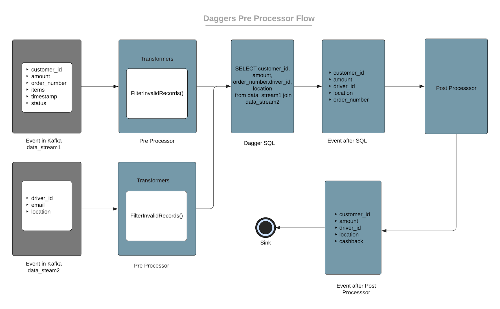

# Introduction
Pre processors enable the users to add Flink operators/transformations before passing on the stream to the SQL query. Each stream registered on daggers can have chained processors. They will run and transform the table before registering it.

## Type of Preprocessors
Currently, there is only one type of pre-processor. 
* [Transformers](docs/../../guides/use_transformer.md)


<p align="center">
  
</p>

## Configuration

Following variables need to be configured as part of PRE_PROCESSOR_CONFIG json

### `table_transformers`

A list of transformer configs.

* Example value: `[{"table_name": "testtable","transformers": [{"transformation_class": "io.odpf.dagger.functions.transformers.InvalidRecordFilterTransformer"}]}]`
* Type: `required`

### `table_name`

Table name for the transformer.

* Example value: `testtable`
* Type: `required`

### `transformers`

List of transformers per table.

* Example value: `[{"transformation_class": "io.odpf.dagger.functions.transformers.InvalidRecordFilterTransformer"}]`
* Type: `required`

### `transformation_class`

Fully qualified name of the class to be used for transformation. Class should be added here.

* Example value: `"io.odpf.dagger.functions.transformers.InvalidRecordFilterTransformer"`
* Type: `required`

### `transformation_arguments`

A key-value map required for parameters required for the custom transformation class.

* Example value: `{"table_name": "testtable"}`
* Type: `optional`

## Sample config
```properties
  SQL_QUERY = "SELECT data_1, data_2, event_timestamp from data_stream"
  PRE_PROCESSOR_ENABLED = true
  PRE_PROCESSOR_CONFIG = {
	"table_transformers": [{
		"table_name": "testtable",
		"transformers": [{
			"transformation_class": "io.odpf.dagger.functions.transformers.InvalidRecordFilterTransformer"
		}]
	}]
}

  ```