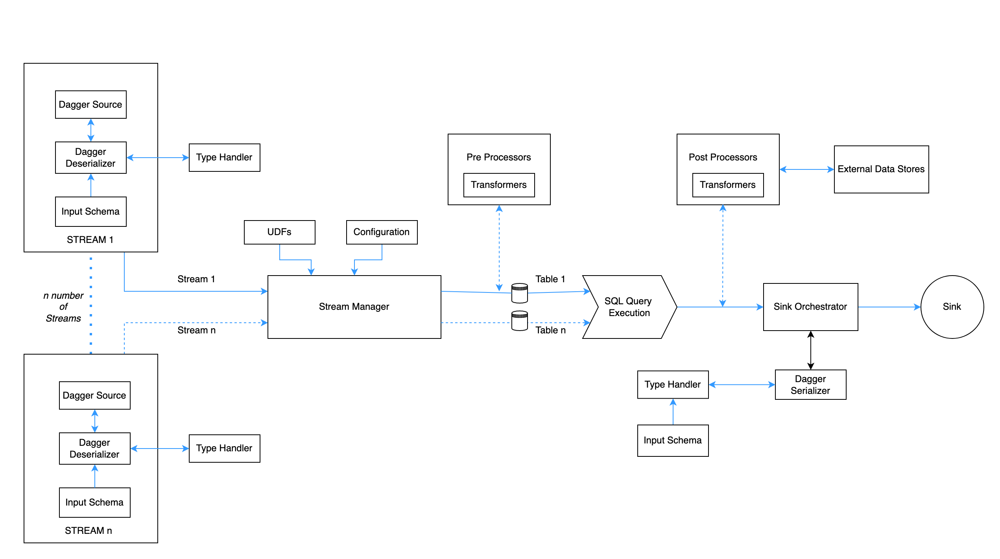

# Architecture

Dagger or Data Aggregator is a cloud native framework built on top of Apache Flink for stateful processing of data.

## System Design

### Components

_**Stream**_

- A Stream defines a logical grouping of a data source and its associated [`protobuf`](https://developers.google.com/protocol-buffers) 
schema. All data produced by a source follows the protobuf schema. The source can be an unbounded one such as
`KAFKA_SOURCE` or `KAFKA_CONSUMER` in which case, a single stream can consume from one or more topics all sharing the 
same schema. Otherwise, the source can be a bounded one such as `PARQUET_SOURCE` in which case, one or more parquet 
files as provided are consumed in a single stream.
- Dagger can support multiple streams at a time.
- For a kafka based source, many Kafka consumer-level configurations like consumer groups and auto offset reset can be set in the stream itself.

_**Dagger Core**_

- The core part of the dagger(StreamManager) has the following responsibilities. It works sort of as a controller for other components in the dagger.
  - Configuration management.
  - Table registration.
  - Configuring Deserialization and Serialization of data.
  - Manage execution of other plugins like pre and post processors.
  - User-Defined functions registration.

_**Pre-Processor**_

- Each stream registered on daggers can have chained pre-processors. They will run and transform the table before registering it for SQL.
- Currently, only [transformers](../guides/use_transformer.md) are supported as part of the pre-processor. Pre-processor are simply Flink's ProcessFunctions/Operators which can transform the input stream to another stream of data prior to execution of SQL. They are ideal for complex filtration logic.

_**SQL Execution**_

- Dagger uses Flink's native SQL Planner to executed SQL(The more powerful Blink Planner will be supported in the next releases).
- In this layer dagger executes streaming SQL (similar to ANSI SQL) on registered unbounded DataStream(s). Flink uses apache calcite for SQL execution.
- In case you have registered any [UDF](../guides/use_udf.md), SQL engines picks them up and lets you use them in your defined SQL query.

_**Type Handler**_

- Type Handler handles the SerDe mechanism for raw source data to Flink understandable Distributed Data format(Flink Row).
- It recursively parses Source specific messages to Flink Row on the consumer side and Flink row to sink specific 
messages on the producer side.
- Dagger supports serialization and deserialization of various data types ranging from primitives such as int, long, float, etc to 
complex types such as maps, nested messages, repeated types, etc.

_**Post-Processor**_

- Post-processors are similar to pre-processors but are rich in functionalities.
- They also enable async processing from external Data source/Service endpoints over network calls and complex transformation beyond SQL.
- They use some of the advanced Flink functionalities like RichFunctions and RichAsyncFunction as the building block. User can define a JSON based DSL to interact with them.
- Some of the supported types of post processors are
  - [External Post-Processors](../advance/post_processor.md#external-post-processor)
  - [Longbow](../advance/longbow.md)
  - [Internal Post-Processors](../advance/post_processor.md#internal-post-processor)
  - [Transformers](../guides/use_transformer.md)

_**Telemetry Processor**_

- For a distributed streaming engine like Dagger, it becomes really essential to collect and report all the essential application-level metrics. The Telemetry Processor is responsible to do so.
- In its core Telemetry Processor is another type of post-processor which internally use pub-sub to collect application metrics.
- After the metrics are collected they need to be sent to some external systems. Metrics reporter which is a library in the Flink cluster does this. Follow [this](https://ci.apache.org/projects/flink/flink-docs-release-1.9/monitoring/metrics.html) for more detailed information about flink metrics.

_**Sink and Serializer**_

- After the data is processed and results are materialized they need to be sinked to some external persistent storage.
- Dagger supports Kafka, BigQuery and InfluxDB as supported sinks where the unbounded results are pushed at the end of the lifecycle.
- In the case of Kafka Sink the final result is protobuf encoded. So the result goes through a serialization stage on some defined output schema. The serializer module of the proto-handler does this. Results in Kafka can be used via any Kafka consumer.
- Influx Sink helps in real-time analytics and dashboarding. In the case of Influx Sink dagger, converts results in Flink Row to InfluxDB points and add `tag`/`labels` as specified in the SQL.
- BigQuery is a data warehouse capable of running SQL queries over large datasets. Bigquery Sink is created using the [ODPF Depot](https://github.com/odpf/depot/tree/main/docs) library. Depot is a sink connector, which acts as a bridge between data processing systems and real sink. In BigQuery Sink, each Flink Row is converted into one BigQuery table row. The schema, table and partitioning details of the table are fetched from user supplied configuration. 

### Schema Handling

- Protocol buffers are Google's language-neutral, platform-neutral, extensible mechanism for serializing structured data. 
Each stream, irrespective of the data source, should produce data according to a fixed, configured protobuf schema.
- Dagger deserializes the data consumed from the topics using the Protobuf descriptors generated out of the artifacts. 
The schema handling i:e, finding the mapped schema for the topic, downloading the descriptors, and dynamically being 
notified of/updating with the latest schema is abstracted through a homegrown library called [stencil](https://github.com/odpf/stencil).
- Stencil is a proprietary library that provides an abstraction layer, for schema handling.
- Schema Caching, dynamic schema updates are features of the stencil client library.

## Dagger Integration

### Dagger Source

- The Data source configuration used by Dagger to generate streaming data. This can be either 
[Kafka](../reference/configuration.md#sample-streams-configuration-using-kafka_consumer-as-the-data-source-) based or 
[Parquet files](../reference/configuration.md#sample-streams-configuration-using-parquet_source-as-the-data-source-). Check 
[here](../guides/choose_source.md) for more details about Dagger Sources. 

### ProtoDescriptors

- Generated protobuf descriptors which are hosted behind an artifactory/HTTP endpoint. This endpoint URL and the proto that the dagger deployment should use to deserialize data can be configured.

### Flink Job Manager

- JobManager is the JVM process that acts as the brain of Flink's execution life cycle. Handles SQL execution, Job Graph creation, Coordinate Task Managers, Snapshotting and many other critical operations for distributed stream processing.

### Flink Task Manager

- Taskmanagers (TM) are the JVM processes which are actually responsible for parallel stateful stream processing of unbounded data. Taskslots are single threads inside Flink's Taskmanager that process single operators in the job graph.

### Zookeeper

- Flink leverages ZooKeeper for distributed coordination between all running JobManager instances. ZooKeeper is a separate service from Flink, which provides highly reliable distributed coordination via leader election and lightweight consistent state storage.

### Object Store

- Operators in Flink can be stateful. In order to make state fault-tolerant, Flink needs to checkpoint the state in some sort of distributed persistent object stores like s3/GCS/HDFS. Checkpoints allow Flink to recover state and positions in the streams to give the application the same semantics as a failure-free execution.

### Metrics Reporter

- Metrics reporter sends the application metrics to some other external systems optimised for metrics data. Metrics reporters can be configured at the cluster level.

### Sink

- InfluxDB - time-series database for real-time analytics.
- Kafka - Replayable queue to easy use of generated results.
- BigQuery - data warehouse capable of running SQL queries over large datasets.